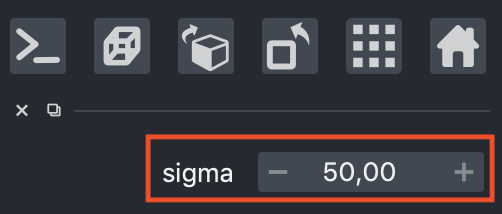
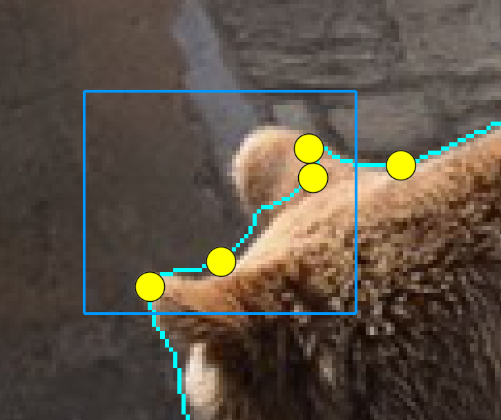

# Grabber: A Tool to Improve Convergence in Interactive Image Segmentation

This repository provides a demo code of the paper:
> **Grabber: A Tool to Improve Convergence in Interactive Image Segmentation**
> [Jordão Bragantini](https://jookuma.github.io/), Bruno Moura, [Alexandre X. Falcão](http://lids.ic.unicamp.br/), [Fábio A. M. Cappabianco](https://scholar.google.com/citations?user=qmH9VEEAAAAJ&hl=en&oi=ao)

<p align="center">
  
</p>

## Installation

```shell script
pip install -r requirements
```

## Usage

```shell script
python demo/app.py <input image> <input mask>
```

<p align="center">
  <figcaption>Anchor movement mode.</figcaption>
  
</p>

<p align="center">
  <figcaption>Anchor movement mode.</figcaption>
  
</p>    

<p align="center">
  <figcaption>Anchor addition mode.</figcaption>
  
</p>   
 
<p align="center">
  <figcaption>Anchor addition mode.</figcaption>
  
</p>   

<p align="center">
  <figcaption>Sigma adherence parameter.</figcaption>
  
</p>


## Citation

If you find this work is useful for your research, please cite our paper:

```
@article{bragantini2020grabber,
  title={Grabber: A Tool to Improve Convergence in Interactive Image Segmentation,
  author={Bragantini, Jord{\~a}o and Bruno Moura, Falc{\~a}o, Alexandre Xavier and Cappabianco, F{\'a}bio AM,
  journal={Pattern Recognition Letters},
  year={2020}
}
```